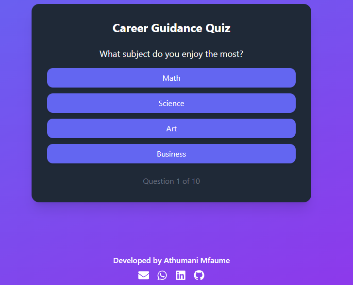
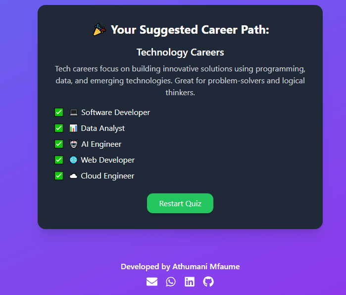

# 🎯 Career Quiz App

live demo  👉 https://careerquizreact.netlify.app/

A simple and interactive career quiz application built with **React** and **Tailwind CSS**.  
The app allows users to answer multiple-choice questions and get personalized career suggestions based on their answers.

---

## 🚀 Features
- ✅ Multiple-choice career-related questions  
- ✅ Interactive UI with **Tailwind CSS** styling  
- ✅ Responsive design (mobile & desktop friendly)  
- ✅ Dynamic results based on user answers  
- ✅ Easy to extend with more questions  

## 🛠️ Tech Stack
- [React](https://react.dev/) – Frontend framework  
- [Tailwind CSS](https://tailwindcss.com/) – Styling  

## 📦 Installation & Setup

1. **Clone the repository**
   ```bash
   git clone https://github.com/athumaniMfaume/career-quiz-react.git
   cd career-quiz
   npm install
   npm run dev

   Open in your browser:
   👉 http://localhost:5173

   📂 Project Structure

   career-quiz/
├── public/             # Static assets
├── src/
│   ├── components/     # Reusable components
│   ├── data/           # Questions & results data
│   ├── App.js          # Main app logic
│   ├── index.css       # Tailwind base styles
│   └── index.js        # Entry point
└── package.json

🖼️ Screenshots

  
   

🔮 Future Improvements

Add progress bar for quiz completion

Store user results in local storage

Allow sharing results on social media

Add more detailed career paths

👨‍💻 Author

Athumani Mfaume

🌍 Dar es Salaam, Tanzania

💼 Software Developer & ICT Specialist

